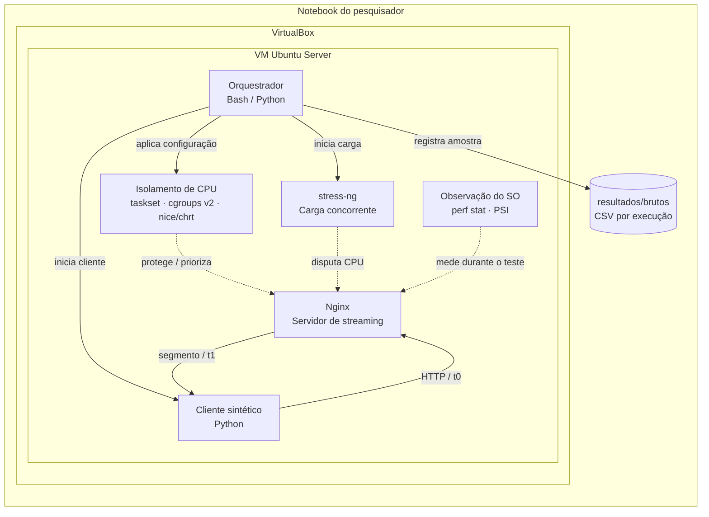
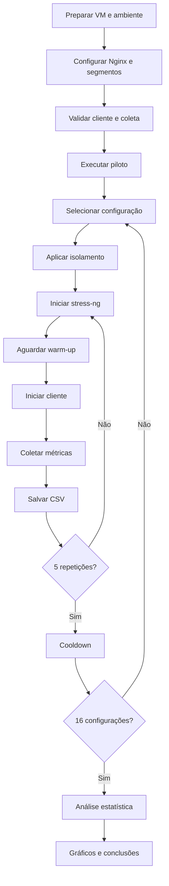

# Streaming sob Contenção de Recursos (Linux, Nginx)

## Disciplina

**Sistemas Operacionais — IFPB**

## Objetivo e escopo

Este projeto investiga o impacto da contenção de CPU no desempenho de um servidor de streaming de vídeo e avalia se mecanismos de isolamento de CPU do Linux conseguem reduzir essa degradação.

O experimento será executado em uma VM Ubuntu sobre VirtualBox. O servidor de streaming será o Nginx, com segmentos de vídeo pré-gerados. Um cliente sintético solicitará os segmentos continuamente enquanto processos concorrentes gerados pelo `stress-ng` disputam CPU com o servidor.

Os resultados representam **esta plataforma experimental local** e não um provedor real de streaming em nuvem.

### Perguntas de pesquisa

1. Como o aumento do número de processos concorrentes afeta o throughput, a latência de resposta e a taxa de rebuffering?
2. Mecanismos de isolamento de CPU reduzem essa degradação? Qual apresenta melhor resultado?
3. O efeito observado nas métricas do sistema operacional acompanha o efeito observado nas métricas de desempenho do streaming?

---

# 1. Arquitetura do ambiente experimental



### Funcionamento

- O **Nginx** disponibiliza segmentos de vídeo pré-gerados.
- O **cliente sintético** solicita os segmentos em sequência, simulando uma reprodução contínua.
- O **stress-ng** gera processos concorrentes que disputam CPU com o servidor.
- O **orquestrador** seleciona a configuração, aplica o isolamento, inicia a carga, executa o cliente e registra os resultados.
- As ferramentas de observação coletam informações do sistema operacional durante o experimento.

---

# 2. Hardware e software

## Hardware

| Item | Especificação |
|---|---|
| Equipamento | Notebook do pesquisador |
| CPU do host | 6 núcleos / 12 threads |
| Memória do host | 8 GB |
| Armazenamento | ~239 GB |
| Hipervisor | Oracle VirtualBox |
| VM | Ubuntu Server LTS |
| vCPUs da VM | 2 |
| RAM da VM | 1–2 GB |

## Software

| Software | Utilização |
|---|---|
| Nginx | Servidor de streaming |
| stress-ng | Geração de contenção de CPU |
| taskset / sched_setaffinity | Afinidade de CPU |
| cgroups v2 | Limitação/garantia de CPU |
| nice / chrt | Prioridade de processos |
| ab / wrk | Requisições HTTP e métricas de throughput/latência |
| perf stat | Context switches e métricas do processo |
| /proc/pressure/cpu | PSI de CPU |
| Python / Bash | Cliente, orquestração e coleta |
| Pandas / SciPy / Matplotlib | Análise e visualização |

Antes da coleta definitiva, serão registradas em `docs/ambiente.md` as versões do kernel, Nginx e demais componentes relevantes.

---

# 3. Fatores e configurações comparados

O experimento combina dois fatores:

| Fator | Níveis |
|---|---|
| **Modo de isolamento** | Sem isolamento; CPU affinity; cgroups; prioridade elevada |
| **Nível de contenção** | 0; 2; 4; 8 processos concorrentes |
| **Condições fixas** | Mesmo conteúdo e mesma taxa de solicitação |

### Total

**4 modos × 4 níveis de contenção = 16 configurações**

| Configuração | Isolamento | Contenção |
|---|---|---:|
| C01 | Sem isolamento | 0 |
| C02 | Sem isolamento | 2 |
| C03 | Sem isolamento | 4 |
| C04 | Sem isolamento | 8 |
| C05 | CPU affinity | 0 |
| C06 | CPU affinity | 2 |
| C07 | CPU affinity | 4 |
| C08 | CPU affinity | 8 |
| C09 | cgroups | 0 |
| C10 | cgroups | 2 |
| C11 | cgroups | 4 |
| C12 | cgroups | 8 |
| C13 | Prioridade | 0 |
| C14 | Prioridade | 2 |
| C15 | Prioridade | 4 |
| C16 | Prioridade | 8 |

---

# 4. Workloads

| ID | Componente | Função |
|---|---|---|
| W1 | Cliente de streaming | Solicita segmentos de vídeo em sequência ao Nginx |
| W2 | stress-ng | Gera processos concorrentes que disputam CPU |

O conteúdo e a taxa de solicitação devem permanecer constantes entre as configurações.

---

# 5. Métricas

A métrica central é a degradação provocada pela contenção e o quanto cada mecanismo de isolamento consegue recuperar o desempenho.

| Métrica | Definição | Coleta |
|---|---|---|
| Throughput | Segmentos ou Mbps entregues por segundo | `ab` / `wrk` |
| Latência | Tempo entre requisição e recebimento do segmento | `ab` / `wrk` / cliente |
| P95 / P99 | Percentis de cauda da latência | `ab` / `wrk` |
| Rebuffering | Segmentos que não chegam a tempo de manter a reprodução | Cliente Python |
| Uso de CPU | CPU utilizada pelo Nginx | `perf stat` / cgroups |
| Context switches | Trocas de contexto | `perf stat` |
| PSI de CPU | Pressão causada pela indisponibilidade de CPU | `/proc/pressure/cpu` |

Para as métricas numéricas serão consideradas, quando aplicável: média, mediana, desvio padrão, p95 e p99.

---

# 6. Ferramentas de medição

- `ab` ou `wrk` — geração de requisições HTTP.
- Cliente próprio em Python — simulação do streaming e cálculo de rebuffering.
- `stress-ng` — geração de contenção.
- `taskset` — afinidade de CPU.
- cgroups v2 — controle de CPU.
- `nice` / `chrt` — prioridade.
- `perf stat` — observação de desempenho e context switches.
- `/proc/pressure/cpu` — PSI.
- Bash/Python — automação e consolidação dos resultados.

---

# 7. Quantidade de repetições

| Item | Quantidade |
|---|---:|
| Piloto | 5 execuções por configuração |
| Coleta definitiva | 5 execuções por configuração |
| Configurações | 16 |
| Execuções definitivas | **80** |
| Duração de cada execução | Ex.: 60 segundos |

Entre execuções será utilizado um período de **cooldown** para encerrar processos e reduzir interferências entre amostras.

---

# 8. Procedimento experimental



### Etapas

1. Preparar a VM.
2. Configurar o Nginx e os segmentos de vídeo.
3. Validar o cliente sintético.
4. Registrar o ambiente em `docs/ambiente.md`.
5. Executar o piloto.
6. Para cada configuração, aplicar o mecanismo de isolamento.
7. Iniciar o `stress-ng`.
8. Aguardar o warm-up.
9. Iniciar o cliente.
10. Coletar as métricas durante o período definido.
11. Salvar a execução em um novo CSV.
12. Repetir cinco vezes.
13. Executar cooldown.
14. Passar para a próxima configuração.
15. Ao final, analisar os dados e gerar os gráficos.

---

# Registro dos resultados

Os resultados brutos serão armazenados em `resultados/brutos/`.

Cada execução deve gerar um arquivo próprio, evitando sobrescrever resultados anteriores.

Exemplo:

```text
resultados/brutos/
├── C01_rep01_2026-10-05.csv
├── C01_rep02_2026-10-05.csv
├── C02_rep01_2026-10-05.csv
└── ...
```

Colunas previstas:

| Coluna | Conteúdo |
|---|---|
| experimento | Identificação do experimento |
| configuração | C01–C16 |
| isolamento | Modo utilizado |
| contenção | Número de processos |
| repetição | Número da repetição |
| timestamp | Data/hora |
| throughput | Vazão medida |
| latência | Latência observada |
| p95 | Percentil 95 |
| p99 | Percentil 99 |
| rebuffering | Taxa observada |
| cpu | Uso de CPU |
| context_switches | Trocas de contexto |
| psi_cpu | Pressão de CPU |
| descartada | Se a amostra foi descartada |

---

# Limitações e ameaças à validade

- **Plataforma local:** os resultados representam a VM Ubuntu utilizada no experimento.
- **Recursos limitados:** a VM possui apenas 1–2 GB de RAM.
- **Carga sintética:** `stress-ng` não representa perfeitamente uma aplicação real.
- **Cliente sintético:** o comportamento é simplificado e não reproduz toda a dinâmica de clientes reais.
- **Virtualização:** o VirtualBox adiciona uma camada de virtualização que pode influenciar os resultados.
- **Streaming simplificado:** o experimento não pretende reproduzir integralmente um serviço comercial de streaming.

As principais medidas de mitigação são manter o conteúdo, a configuração do cliente e o procedimento constantes, monitorar memória/swap e registrar o ambiente antes das coletas.

---

# Pontos a validar com o professor

1. O uso de uma VM Ubuntu sobre VirtualBox é aceitável para o experimento?
2. As 16 configurações e 5 repetições são adequadas ao escopo da disciplina?
3. O cliente sintético simplificado é suficiente?
4. É necessário utilizar HLS/DASH de forma mais próxima de um cenário real?
5. `ab` ou `wrk` deve ser escolhido como ferramenta principal de geração de requisições?
6. A taxa de rebuffering calculada pelo cliente é uma métrica adequada para o projeto?

---

# Estrutura do repositório

```text
.
├── README.md
├── docs/
│   └── ambiente.md
├── orquestrador/
│   └── README.md
├── workloads/
│   └── README.md
├── configs/
│   └── README.md
├── resultados/
│   └── brutos/
│       └── .gitkeep
├── analise/
│   └── README.md
└── latex/
    └── README.md
```

| Pasta | Conteúdo |
|---|---|
| `docs/` | Registro do ambiente e informações da execução |
| `orquestrador/` | Scripts que automatizam os experimentos |
| `workloads/` | Nginx, segmentos e cliente sintético |
| `configs/` | Configurações dos mecanismos de isolamento |
| `resultados/` | Dados brutos coletados |
| `analise/` | Estatística e gráficos |
| `latex/` | Documentação final do projeto |

---

# Referências

- Documentação do Linux sobre cgroups v2: https://docs.kernel.org/admin-guide/cgroup-v2.html
- Documentação do Linux sobre PSI: https://docs.kernel.org/accounting/psi.html
- stress-ng: https://github.com/ColinIanKing/stress-ng
